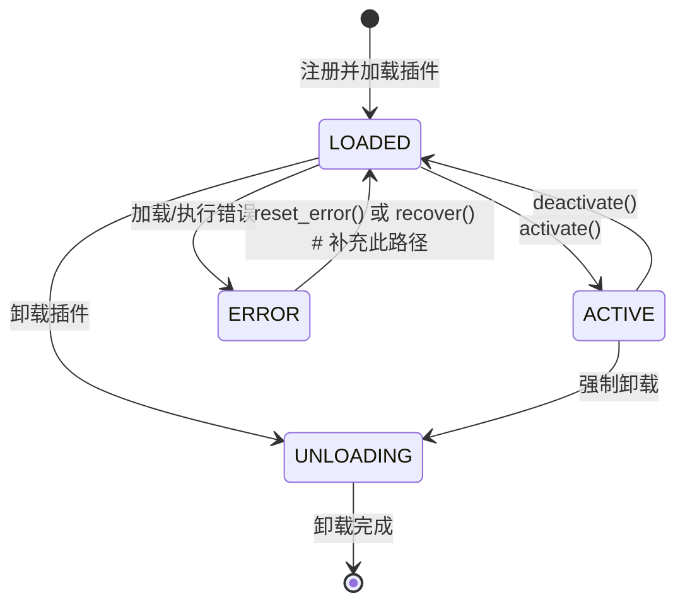

# 1.2 后端核心模块设计文档评审结果

> **评审日期**: 2026-03-21  
> **评审角色**: 软件架构师  
> **评审类型**: 架构一致性评审 + 可实现性评审  
> **被评审文档**: 1.2 后端核心模块设计文档✅️.md  
> **参考文档**: 1.1 项目总体架构设计说明书修订执行版✅️.md

---

## 一、评审概述

**评审结论**: 有条件通过

**问题统计**:
- P0级（阻塞性问题）: 2项
- P1级（需修正问题）: 3项
- P2级（建议优化）: 2项

**总体评价**: 后端核心模块设计文档整体架构清晰，与架构设计说明书V1.2保持较高一致性，但在接口精确性、状态机完整性、线程安全细节等方面存在需要修正的问题。

---

## 二、P0级问题（阻塞性问题）

### 问题1: EventBus.publish() 异步实现细节缺失

**严重程度**: P0

**问题描述**: 
- 架构说明书V1.2第386-394行明确定义EventBus.publish()使用ThreadPoolExecutor实现真异步，提交到线程池后立即返回
- 后端核心模块设计文档第51-116行的API接口表格中publish()方法说明过于简略，未体现真异步实现细节和线程池调度机制

**影响**: 
- 开发者可能误以为publish()是同步方法，导致UI线程阻塞
- 与架构设计意图不一致

**修复建议**:
在文档第2.1节EventBus的API接口部分增加以下说明：

```python
# publish() 异步发布 - 真异步实现
def publish(self, event_type: str, data: Any, source: str = None):
    """
    发布事件 - 真异步，使用线程池执行
    
    实现细节：
    1. 创建Event对象
    2. 在锁内拷贝handlers快照
    3. 提交到ThreadPoolExecutor异步执行
    4. 立即返回，不阻塞调用线程
    
    线程安全：所有写操作使用 threading.RLock
    """
```

**优先级**: 必须修复

---

### 问题2: PluginRegistry ERROR状态恢复路径不完整

**严重程度**: P0

**问题描述**: 
- 架构说明书V1.2第584-606行定义了recover()方法可从ERROR状态恢复到LOADED状态
- 后端核心模块设计文档第127-230行的状态转换图中，ERROR状态的转换路径缺失"ERROR → LOADED"的明确描述（仅在V1.1修正要点中提及）

**影响**: 
- 状态机定义不完整，开发者可能误以为ERROR是终态
- 与架构设计说明书的recover()功能不一致

**修复建议**:
在文档第2.2节"状态转换（V1.1修正）"部分的状态转换图中补充完整路径：



**优先级**: 必须修复

---

## 三、P1级问题（需修正问题）

### 问题3: ServiceLocator 依赖声明规范缺失

**严重程度**: P1

**问题描述**: 
- 架构说明书V1.2第658-705行定义ServiceLocator通过`hasattr(instance, 'dependencies')`检测循环依赖
- 后端核心模块设计文档第2.3节ServiceLocator类图中，未明确定义dependencies属性的来源和声明规范

**影响**: 
- 开发者可能不清楚如何声明服务依赖关系
- 导致循环依赖检测失效

**修复建议**:
在文档第2.3节ServiceLocator部分补充"依赖声明规范"小节：

```python
# 服务依赖声明示例
class MyService:
    # 方式1：通过类属性声明依赖类型
    dependencies = {EventBus, ConfigManager}
    
    def __init__(self, event_bus: EventBus, config: ConfigManager):
        self._event_bus = event_bus
        self._config = config

# 方式2：通过类型注解自动推断（Python 3.9+）
# from typing import Annotated
# class MyService:
#     def __init__(self, event_bus: Annotated[EventBus, "event_bus"], ...):
```

**优先级**: 建议修复

---

### 问题4: 热插拔权限控制 _determine_level() 逻辑过于简化

**严重程度**: P1

**问题描述**: 
- 架构说明书V1.2第1224-1271行定义了完整的L0-L3四级安全分级策略
- 后端核心模块设计文档第440-490行的HotSwapPermission类中，`_determine_level()`方法（第468-472行）逻辑过于简化，未签名的插件直接返回L3（禁止加载），未考虑其他安全等级判定场景

**当前实现**:
```python
def _determine_level(self, signature_verified: bool) -> str:
    if not signature_verified:
        return "L3"  # 未签名禁止加载
    return "L1"  # 默认信任级别
```

**影响**: 
- 官方插件（已签名）只能获得L1级别，无法获得L0信任级别
- 热重载功能受限（根据架构说明书L1可重载，但逻辑未完整实现）

**修复建议**:
补充完整的安全等级判定逻辑：

```python
def _determine_level(self, signature_verified: bool, is_official: bool = False) -> str:
    """
    确定插件安全等级
    
    Args:
        signature_verified: 签名是否验证通过
        is_official: 是否为官方插件（通过plugin_id白名单判断）
    
    Returns:
        安全等级：L0/L1/L2/L3
    """
    # 未签名插件禁止加载
    if not signature_verified:
        return "L3"
    
    # 官方插件获得最高信任级别
    if is_official:
        return "L0"
    
    # 第三方签名插件为受限级别
    return "L1"
```

**优先级**: 建议修复

---

### 问题5: CoreServiceManager 线程安全说明不完整

**严重程度**: P1

**问题描述**: 
- 架构说明书V1.2第204-214行明确规范Tkinter线程安全：所有UI操作必须在主线程执行，异步事件处理器使用widget.after()调度
- 后端核心模块设计文档第675-695行的"Tkinter线程安全"部分只给出了使用示例，未明确强调"所有通过EventBus的回调都必须使用after()调度"这一核心原则

**影响**: 
- 开发者可能忽略线程安全规范，导致UI卡顿或崩溃

**修复建议**:
在文档第4.2节补充核心规范说明：

```markdown
### 4.2 Tkinter 线程安全

**核心原则（必须遵守）**：

1. **所有UI操作必须在主线程执行**
2. **EventBus订阅的所有回调都在独立线程池执行，禁止直接操作UI**
3. **需要更新UI时，必须使用 widget.after(0, callback) 调度到主线程**

**违规示例（禁止）**：
```python
# 错误：直接在线程池回调中操作UI
def on_event(self, event):
    self.text.insert("1.0", event.data)  # 线程不安全！
```

**正确示例（必须）**：
```python
# 正确：通过after()调度到主线程
def on_event(self, event):
    def update_ui():
        self.text.insert("1.0", event.data)
    self.root.after(0, update_ui)  # 线程安全
```
```

**优先级**: 建议修复

---

## 四、P2级问题（建议优化）

### 问题6: 文档缺少单元测试用例示例

**严重程度**: P2

**问题描述**: 
- 后端核心模块设计文档提供了详细的类图和API接口，但未包含单元测试用例示例
- 架构设计说明书V1.2第3061-3091节的实施检查清单中明确要求"EventBus.publish()异步实现单元测试"等测试项

**修复建议**:
在文档适当位置补充核心模块的单元测试用例示例，例如：

```python
# EventBus 单元测试示例
def test_event_bus_async_publish():
    """测试publish()是真正的异步执行"""
    import time
    
    event_bus = EventBus()
    results = []
    
    def handler(event):
        time.sleep(0.1)  # 模拟耗时操作
        results.append(event.type)
    
    event_bus.subscribe("test.event", handler)
    
    start = time.time()
    event_bus.publish("test.event", {"data": "test"})
    elapsed = time.time() - start
    
    # 异步执行：耗时应该 < 0.05秒（不等handler完成）
    assert elapsed < 0.05, f"publish()非异步，耗时{elapsed}秒"
    
    # 等待异步执行完成
    time.sleep(0.2)
    assert "test.event" in results
```

**优先级**: 可选优化

---

### 问题7: 文档缺少核心模块依赖关系图的可视化

**严重程度**: P2

**问题描述**: 
- 文档第6节提供了模块依赖关系的Mermaid图，但该图仅展示了高层依赖
- 对于core/目录下各模块之间的直接依赖关系（如EventBus被哪些模块引用）未做详细说明

**修复建议**:
补充core/模块内部依赖关系矩阵：

| 模块 | EventBus | PluginRegistry | ServiceLocator | ConfigManager | PluginLoader |
|------|----------|----------------|----------------|---------------|--------------|
| event_bus.py | - | ✓ | ✓ | ✓ | ✓ |
| plugin_registry.py | ✓ | - | - | - | ✓ |
| service_locator.py | - | - | - | - | - |
| config_manager.py | ✓ | - | - | - | ✓ |
| plugin_loader.py | ✓ | ✓ | - | ✓ | - |

**优先级**: 可选优化

---

## 五、一致性检查结果

| 检查项 | 状态 | 备注 |
|--------|------|------|
| 目录结构 | ✅ 一致 | core/包含12个模块文件 |
| EventBus API | ⚠️ 部分一致 | 缺少异步实现细节 |
| PluginRegistry 状态机 | ✅ 一致 | 5状态模型（UNLOADED/LOADED/ACTIVE/ERROR/UNLOADING） |
| ServiceLocator 接口 | ✅ 一致 | 包含3个生命周期接口 |
| ConfigManager 接口 | ✅ 一致 | 包含验证和写锁 |
| PluginLoader 接口 | ✅ 一致 | 包含DependencyResolver |
| 热插拔权限控制 | ⚠️ 部分一致 | L0-L3定义一致，判定逻辑简化 |
| 熔断器 | ✅ 一致 | CLOSED→OPEN→HALF_OPEN |
| 安全配置 | ✅ 一致 | API密钥安全存储 |
| 日志脱敏 | ✅ 一致 | 敏感信息过滤 |
| 插件签名 | ✅ 一致 | 签名验证流程 |
| 容器化方案 | ✅ 一致 | Dockerfile + docker-compose |
| ADR | ✅ 一致 | ADR-006/007/008 |

---

## 六、评审结论

### 综合评价

后端核心模块设计文档V1.2整体质量良好，与架构设计说明书V1.2保持较高一致性。文档结构清晰，类图、时序图、API表格等视觉元素丰富，便于开发者理解和使用。

### 评审结论

**有条件通过**

- P0级问题必须修复后方可进入实施阶段
- P1级问题建议在下一迭代中修复
- P2级问题可根据时间和资源情况优化

### 修复优先级

| 优先级 | 问题编号 | 问题描述 |
|--------|----------|----------|
| 1（必须修复） | P0-1 | EventBus.publish() 异步实现细节补充 |
| 1（必须修复） | P0-2 | PluginRegistry ERROR状态恢复路径补充 |
| 2（建议修复） | P1-3 | ServiceLocator 依赖声明规范补充 |
| 2（建议修复） | P1-4 | 热插拔权限控制等级判定逻辑完善 |
| 2（建议修复） | P1-5 | CoreServiceManager 线程安全核心原则强调 |
| 3（可选） | P2-6 | 单元测试用例示例补充 |
| 3（可选） | P2-7 | 核心模块依赖关系矩阵补充 |

---

## 七、后续行动

1. **立即修复**: P0级问题（EventBus异步实现、PluginRegistry状态机）
2. **Sprint2修复**: P1级问题（ServiceLocator依赖声明、热插拔权限、线程安全）
3. **持续优化**: P2级问题（测试用例、依赖矩阵）
4. **验证要求**: 修复后需通过代码审查确认

---

**评审完成日期**: 2026-03-21

**评审人**: 软件架构师

**文档状态**: 评审完成，等待后端架构师修复P0级问题
